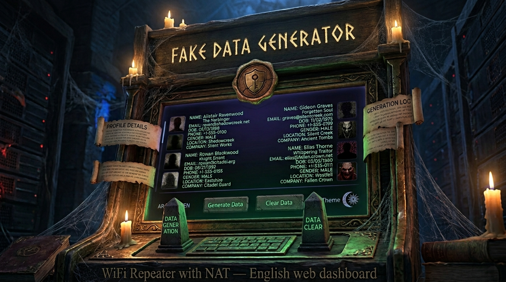

# Fake Data Generator - مولد البيانات الوهمية

A modern, multilingual fake data generator web application that supports both Arabic and English languages with full RTL (right-to-left) support. Generate realistic test data for development, testing, and privacy protection purposes.

## 🌟 Features

- **Multilingual Support**: Full support for English and Arabic languages with RTL layout
- **Comprehensive Data Generation**: Generate realistic user profiles including:
  - Full names (culturally appropriate for each language)
  - Email addresses
  - Phone numbers (Egyptian format)
  - Strong passwords
  - Usernames
  - Locations
  - Date of birth
  - Gender
  - Avatar images
  - Addresses
  - Company names
  - Job titles

- **Modern UI/UX**: 
  - Responsive design that works on all devices
  - Smooth animations and transitions
  - Clean, professional interface
  - Copy-to-clipboard functionality for individual fields and all data

- **Local Storage**: Temporary data persistence with automatic expiration
- **External Links**: Quick access to more projects and social media

## 🚀 Quick Start

### Prerequisites
- Node.js 18 or higher
- npm or yarn

### Installation

1. Clone the repository:
```bash
git clone <your-repo-url>
cd fake-data-generator
```

2. Install dependencies:
```bash
npm install
```

3. Start the development server:
```bash
npm run dev
```

4. Open your browser and navigate to `http://localhost:5000`

## 📁 Project Structure

```
├── client/                 # Frontend React application
│   ├── src/
│   │   ├── components/     # Reusable UI components
│   │   ├── hooks/         # Custom React hooks
│   │   ├── lib/           # Utility functions and data generators
│   │   ├── pages/         # Application pages
│   │   └── main.tsx       # Application entry point
│   └── index.html         # HTML template
├── server/                 # Backend Express server
├── shared/                 # Shared TypeScript types
├── standalone-index.html   # Single-file version of the application
└── README.md              # This file
```

## 🛠️ Technology Stack

- **Frontend**: React 18, TypeScript, Tailwind CSS, Vite
- **Backend**: Node.js, Express.js, TypeScript
- **UI Components**: Radix UI, shadcn/ui
- **Data Generation**: Faker.js
- **Database**: PostgreSQL with Drizzle ORM
- **Routing**: Wouter
- **State Management**: TanStack Query

## 🌐 Deployment

### Replit Deployment
This project is optimized for Replit deployment. Simply:
1. Import this repository into Replit
2. Run `npm install`
3. Start with `npm run dev`

### Other Platforms
For deployment on other platforms, you may need to:
1. Build the project: `npm run build`
2. Configure environment variables for your database
3. Deploy both frontend and backend

## 📋 Available Scripts

- `npm run dev` - Start development server
- `npm run build` - Build for production
- `npm run preview` - Preview production build
- `npm run db:push` - Push database schema changes
- `npm run db:generate` - Generate database migrations

## 🔧 Configuration

### Environment Variables
Create a `.env` file in the root directory:

```env
DATABASE_URL=your_postgresql_url
NODE_ENV=development
```

### Database Setup
The application uses PostgreSQL with Drizzle ORM. Database tables are automatically created when needed.

## 🎨 Customization

### Adding New Languages
1. Update `client/src/lib/translations.ts` with new language translations
2. Add appropriate data arrays in `client/src/lib/data-generator.ts`
3. Update language toggle component

### Styling
- Modify `client/src/index.css` for global styles
- Update Tailwind configuration in `tailwind.config.ts`
- Customize component styles in individual component files

## 📱 Responsive Design

The application is fully responsive and works seamlessly across:
- Desktop computers
- Tablets
- Mobile phones
- Different screen orientations

## 🔒 Privacy & Security

- No real user data is stored or transmitted
- All generated data is fictional and safe for testing
- Local storage is used for temporary data caching only
- External links open in new tabs with security measures

## 🤝 Contributing

1. Fork the repository
2. Create a feature branch: `git checkout -b feature-name`
3. Make your changes and commit: `git commit -m 'Add feature'`
4. Push to the branch: `git push origin feature-name`
5. Submit a pull request

## 📄 License

This project is open source and available under the [MIT License](LICENSE).

## 🔗 Links

- **More Projects**: [Portfolio Website](https://ibrahimmustafacv.github.io/)
- **Social Media**: [Follow Us](https://ibrahimmustafacv.github.io/my-social-media-page/)

## 🙏 Acknowledgments

- [Faker.js](https://fakerjs.dev/) for data generation
- [Tailwind CSS](https://tailwindcss.com/) for styling
- [Radix UI](https://radix-ui.com/) for accessible components
- [React](https://reactjs.org/) for the UI framework

---

Made with ❤️ for developers who need realistic test data
